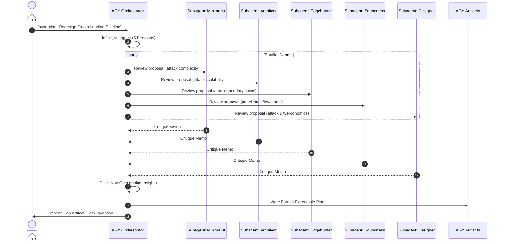

# Cross-Harness Skill Adoption & Migration Proposal
## Unified Agent Capability Strategy for Google Antigravity (AGY), OpenCode, Codex CLI, and Senpi

> **Document Type:** Architecture & Implementation Strategy Proposal  
> **Status:** Proposed / Review Ready  
> **Target Date:** October 2026  
> **Target Harnesses:** Google Antigravity (AGY), OpenCode (OMO Ultimate), Codex CLI (OMO Light), Senpi (OMO Native), and Claude Code  

---

## 1. Executive Summary & Problem Statement

As multi-agent ecosystems evolve, development teams find themselves utilizing multiple heterogeneous AI agent harnesses simultaneously:
1. **Google Antigravity (AGY):** Deeply integrated IDE/OS assistant with native subagents (`invoke_subagent`, `define_subagent`), reactive background task management, interactive artifacts (`<appDataDir>\brain`), and MCP integration.
2. **OpenCode (OMO Ultimate):** Full-featured TUI/CLI environment with 54+ lifecycle hooks, rich multi-agent orchestration (`call_omo_agent`, `task`), hashline editing, and workspace isolation.
3. **Codex CLI (OMO Light / lazycodex):** Rust-powered daemon harness with JSON-RPC app-server, native multi-agent tools (`multi_agent_v1`/`v2`), and `CODEX_HOME` sandboxing.
4. **Senpi (OMO Native):** High-throughput DAG engine with dependency-frontier scheduling, persistent process residency, and inter-agent mailbox IPC.

### The Problem
Historically, skills, workflows, and tools were authored with harness-specific assumptions:
- Hardcoded subagent calls (e.g., `call_omo_agent(explore)` vs `multi_agent_v1.spawn_agent` vs `invoke_subagent`).
- Harness-specific file mutation primitives (e.g., Hashline `LINE#HASH|` vs `replace_file_content` vs `apply_patch`).
- Fragmented evidence and artifact storage (`.omo/evidence/` vs native AGY conversation artifacts).

### The Objective
Establish a **Universal Cross-Harness Skill Architecture** that allows high-value OMO skills and workflows to run seamlessly across all harnesses—with a specific, prioritized migration and tuning plan for **Google Antigravity (AGY)**.

---

## 2. Cross-Harness Skill Adoption Matrix

We evaluate all shipped skills across utility, cross-harness portability, and the required adaptation effort for AGY and sibling harnesses.

```
+----------------------------------------------------------------------------------------------------+
|                                    SKILL ADOPTION TIERS                                            |
+----------------------------------------------------------------------------------------------------+
|  TIER 1: Immediate Universal Adoptions (Zero to Low Adaptation - Ready Today)                     |
|  * remove-ai-slops    * init-deep           * tech-debt-audit     * ulw-plan                      |
|  * frontend           * visual-qa           * git-master          * debugging / refactor          |
+----------------------------------------------------------------------------------------------------+
|  TIER 2: High-Value Multi-Agent Workflows (Medium Adaptation - Tuned for AGY & Codex)              |
|  * ulw-research       * hyperplan           * work-with-pr        * security-research             |
|  * pre-publish-review * remove-deadcode     * github-triage                                       |
+----------------------------------------------------------------------------------------------------+
|  TIER 3: Tool- & Runtime-Coupled Engines (Engine Extraction / MCP Migration)                      |
|  * ast-grep (sg)      * browser (omowright) * ultimate-browsing   * lsp-tools (MCP)               |
|  * boulder-state      * senpi-task (DAG)                                                          |
+----------------------------------------------------------------------------------------------------+
```

### Detailed Evaluation Table

| Skill | Core Capability | Cross-Harness Value | AGY / Multi-Harness Adaptation Strategy |
|---|---|---|---|
| **`remove-ai-slops`** | 9-category purge of AI boilerplate, placeholder comments, and redundant wrappers behind regression tests. | **CRITICAL (10/10)** | **Direct Adoption:** Pure instruction logic. Can be placed directly in `.agents/skills/remove-ai-slops/` or `~/.gemini/config/skills/`. |
| **`init-deep`** | Discovers project structure via symbols and builds hierarchical `AGENTS.md` docs across subdirectories. | **CRITICAL (10/10)** | **Tuned for AGY:** Replace OMO's background task bash spawns with AGY's `invoke_subagent(research)` calls; query CodeGraph MCP or native grep. |
| **`ulw-plan`** | Structured planning producing checklist tasks (`T1`, `T2`) and explicit verification waves (`F1`). | **VERY HIGH (9/10)** | **Direct Adoption:** Standardizes the plan format across all harnesses. Directly renders into AGY artifacts. |
| **`ulw-research`** | Maximum-saturation research with claim-graph verification, contested claim testing, and delivery gates. | **CRITICAL (10/10)** | **Tuned for AGY:** Map worker swarms to AGY's `invoke_subagent` and background shell commands; save final report to `resources/` and brain artifacts. |
| **`hyperplan`** | 5-persona adversarial planning (Unspecified-Low/High, Deep, Ultrabrain, Artistry) to eliminate blind spots. | **CRITICAL (10/10)** | **Tuned for AGY:** In OMO, uses Team Mode. In AGY, define 5 subagents via `define_subagent` with specific hostile personas, synthesize in orchestrator. |
| **`work-with-pr`** | Task-owned git worktree isolation, atomic PR decomposition, manual QA evidence capture, and merge verification. | **CRITICAL (10/10)** | **Tuned for AGY:** Execute `git worktree` via `run_command`; save evidence to `.omo/evidence/`; leverage AGY's `github-mcp-server` for PR creation and checks. |
| **`tech-debt-audit`** | 9-dimension health check using AST-grep and LSP, emitting quantified `TECH_DEBT_AUDIT.md`. | **VERY HIGH (9/10)** | **Direct Adoption:** Relies on `sg` and file inspection; outputs markdown report directly into repo or `resources/`. |
| **`security-research`**| Team Mode audit: 3 vulnerability hunters + 2 PoC engineers in parallel proving exploitability. | **VERY HIGH (9/10)** | **Tuned for AGY:** Spawn parallel AGY subagents with distinct hunting roles; write verified exploit PoCs into isolated scratch directories. |
| **`frontend` & `visual-qa`** | Design token adherence, style galleries, responsive layouts, and headless screenshot verification. | **HIGH (8/10)** | **Tuned for AGY:** Combine with AGY's `agent-browser` or `chrome-devtools` MCP to snapshot and inspect rendered components. |
| **`ast-grep`** | AST-based syntax tree search and rewrite (`sg`) with high structural precision. | **HIGH (8/10)** | **Tool Wrapper:** Package the `sg` binary installer for Windows/Mac/Linux; expose as an executable command or MCP tool. |
| **`boulder-state`** | Resilient task progress tracking (`boulder.json`) across sessions, forks, and compactions. | **HIGH (8/10)** | **Core Library Adoption:** Import `@oh-my-opencode/boulder-state` in project scripts, or implement as a lightweight state tracker in `.omo/`. |

---

## 3. The Universal Harness Abstraction Layer (HAL)

To make skills runnable across AGY, OpenCode, Codex, and Claude Code without duplicating skill directories, every multi-agent or tool-intensive skill should incorporate a standardized **Harness Compatibility Section** at the top of `SKILL.md`.

### 3.1 The Canonical Harness Translation Matrix

```markdown
## Harness Tool Compatibility & Translation Guide

When executing this skill, translate the workflow operations into your active harness primitives:

| Workflow Operation | OpenCode (OMO) | Google Antigravity (AGY) | Codex CLI (OMO Light) | Claude Code / Generic |
|---|---|---|---|---|
| **Spawn Subagent** | `call_omo_agent(...)` or `task(...)` | `invoke_subagent(Role, Prompt, Model)` | `multi_agent_v1.spawn_agent(...)` | Subagent tool / background CLI |
| **Define Persona** | `agentSources` / config | `define_subagent(name, prompt)` | `agents/openai.yaml` roles | System prompt prepend |
| **Background Task** | `task(run_in_background=true)` | `run_command(WaitMsBeforeAsync)` | `spawn_agent` + async wait | `nohup` / `&` shell execution |
| **File Read** | `read` / `file_read` | `view_file(AbsolutePath, Start, End)` | `read_file` | Read tool / cat |
| **File Edit** | `edit` (hashline) / `apply_patch`| `replace_file_content` / `write_to_file` | `apply_patch` / `file_edit` | Edit tool / patch |
| **Code Intelligence**| `lsp_*` aliases / `grep` | `codegraph_*` MCP / `grep` | `lsp_*` / `grep` | grep / ripgrep |
| **Browser Action** | `browser` (`omowright`) | `agent-browser` MCP / `read_url_content`| `browser` tool | Playwright / curl |
| **Deliverable Store**| `.omo/plans/`, `.omo/evidence/` | `resources/` and brain artifacts | `.omo/evidence/` | Repo root / docs |
| **User Interaction**| First-turn chat prompt | `ask_question(...)` interactive modal | TUI stdin | CLI prompt / question tool |
```

---

## 4. AGY-Specific Tuning & Migration Blueprints

Here is how the four most powerful OMO workflows should be tuned specifically for Google Antigravity (AGY).

### 4.1 Tuned Workflow: `hyperplan` for Antigravity (AGY)

**OMO Architecture:** Relies on OpenCode Team Mode with dynamic category spawns (`unspecified-low`, `unspecified-high`, etc.).  
**AGY Tuned Architecture:**
1. **Dynamic Subagent Registration:** AGY calls `define_subagent` for each hostile persona:
   - `hyperplan-minimalist`: Attacks over-engineering; advocates standard library and existing utilities.
   - `hyperplan-architect`: Attacks scalability, concurrency, state synchronization, and failure modes.
   - `hyperplan-edgehunter`: Attacks nullability, type boundaries, network partitions, and error paths.
   - `hyperplan-soundness`: Attacks invariant preservation, type proofs, and formal correctness.
   - `hyperplan-designer`: Attacks API ergonomics, documentation friction, and developer DX.
2. **Parallel Dispatch:** AGY calls `invoke_subagent` with all 5 definitions concurrently.
3. **Reactive Gathering:** AGY automatically receives responses when each subagent finishes (no polling required).
4. **Synthesis & Interactive Decision:** The parent AGY agent synthesizes the defensible points into an interactive **Artifact** in `<appDataDir>\brain\<conversation-id>`, and uses `ask_question` to resolve any remaining forks with the user.



---

### 4.2 Tuned Workflow: `work-with-pr` for Antigravity (AGY)

**OMO Architecture:** Creates `.worktrees/<branch>` directories, runs tests via local bash, verifies SSE hooks, opens PR via GitHub CLI.  
**AGY Tuned Architecture:**
1. **Sandbox Creation:** Execute `run_command` to create a dedicated git worktree:
   ```pwsh
   git worktree add -b feat/task-name .omo/worktrees/feat-task-name dev
   ```
2. **Implementation & Invariant Testing:** Perform code modifications inside the worktree using `replace_file_content`.
3. **Mandatory Surface Driving & Evidence Recording:**
   - Run the actual server / CLI / TUI process in the background (`WaitMsBeforeAsync: 3000`).
   - Capture real outputs and write to `.omo/evidence/<timestamp>-<slug>/evidence.log`.
   - Compute SHA256 checksums of evidence files.
4. **Automated PR & Verification:**
   - Use AGY's lazily-loaded `github-mcp-server` (`create_pull_request`, `get_commit`, `list_pull_requests`) to push the branch, open a PR with the complete evidence summary, and monitor CI status.
   - Once CI is green, execute a clean merge commit and clean up the worktree:
     ```pwsh
     git worktree remove .omo/worktrees/feat-task-name
     ```

---

### 4.3 Tuned Workflow: `ulw-research` for Antigravity (AGY)

**OMO Architecture:** Fans out bash workers, runs Node CLI `report-tools.mjs`, generates claim graphs, enforces `outcome verify`.  
**AGY Tuned Architecture:**
1. **Multi-Source Fan-Out:**
   - Web Search & Scrape: Leverage AGY's eager `search_web` and lazy `firecrawl` / `zyte` MCP tools.
   - Codebase Search: Leverage CodeGraph MCP (`codegraph_explore`) and AGY's `view_file` / `run_command`.
   - Subagent Swarm: Launch parallel `invoke_subagent` calls for distinct research axes.
2. **Code Proof for Contested Claims:**
   - If a claim about performance or undocumented behavior is contested, AGY generates a test script in the scratch directory (`scratch/bench.ts`) and executes it via `run_command`.
3. **Deliverable Gate & Automatic Saving:**
   - In accordance with the AGY user rule, the final synthesized report is written to:
     `resources/<topic>-comprehensive-research.md`
   - Simultaneously creates an interactive visual artifact summarizing key trade-offs and citations.

---

### 4.4 Tuned Workflow: `remove-ai-slops` for Antigravity (AGY)

**OMO Architecture:** Pre-commit/post-tool hook integrated with `@code-yeongyu/comment-checker` binary.  
**AGY Tuned Architecture:**
- Available directly as a prompt skill in `.agents/skills/remove-ai-slops/SKILL.md`.
- Can be invoked proactively by AGY prior to completing any PR or large refactor turn:
  1. Inspect `git diff` against `main` or merge-base.
  2. Verify regression tests are passing.
  3. Perform a 3-pass cleanup:
     - Pass 1: Strip obvious comments, trivial docstrings, and section banners.
     - Pass 2: Replace over-defensive null checks and broad catches (`except Exception`) with specific narrow types.
     - Pass 3: Eliminate single-use wrapper abstractions and dead helper functions.
  4. Verify all tests remain 100% green.

---

## 5. Implementation & Rollout Roadmap

```
+----------------------------------------------------------------------------------------------------+
|                                      IMPLEMENTATION PHASES                                         |
+----------------------------------------------------------------------------------------------------+
|                                                                                                    |
|  PHASE 1: Unified Skills Layout Consolidation                                                      |
|  * Ensure .agents/skills/ is the authoritative cross-harness directory (AGY + OMO + Codex).         |
|  * Add Universal Translation Matrix header to all shared skills.                                   |
|                                                                                                    |
|  PHASE 2: Antigravity (AGY) Skill Porting & Tuning                                                 |
|  * Port hyperplan, work-with-pr, ulw-research, and remove-ai-slops to native AGY tool syntax.      |
|  * Connect AGY MCP tools (github-mcp-server, agent-browser, codegraph) into skill workflows.        |
|                                                                                                    |
|  PHASE 3: Core Tooling Packaging (Zero-Friction Reusability)                                       |
|  * Package hashline-core and rules-engine as standalone npm/npx CLI utilities.                     |
|  * Provide a unified lsp-tools MCP server configuration loadable by AGY and Claude Code.           |
|                                                                                                    |
|  PHASE 4: Cross-Harness Verification & Gate Testing                                                |
|  * Validate identical workflow execution under AGY (Windows/PowerShell) and OMO (Linux/Mac/tmux).  |
|                                                                                                    |
+----------------------------------------------------------------------------------------------------+
```

### Immediate Action Items:
1. **Adopt `.agents/skills/` as the Cross-Harness Root:** Both AGY and OMO naturally discover `.agents/skills/`. Placing our tuned skills here guarantees they are instantly accessible across both environments.
2. **Deploy the `hyperplan` and `work-with-pr` AGY Tuned Variants:** Implement the multi-subagent `hyperplan` orchestrator and the worktree-isolated PR pipeline.
3. **Register MCP Tools in Skill Instructions:** Update skill references to explicitly route through available MCP servers (`github-mcp-server`, `codegraph`, `agent-browser`) when present.

---

## 6. Conclusion & Recommendation

By decoupling skill logic from harness-specific APIs and introducing the **Universal Harness Translation Matrix**, we can transform OMO's battle-tested engineering skills into universal assets. 

**Google Antigravity (AGY)** is uniquely well-suited to run these advanced workflows because of its native subagent management, reactive execution architecture, and rich MCP ecosystem. Adopting these protocols will immediately elevate AGY from an interactive coding assistant to a fully autonomous, evidence-bound engineering partner.
