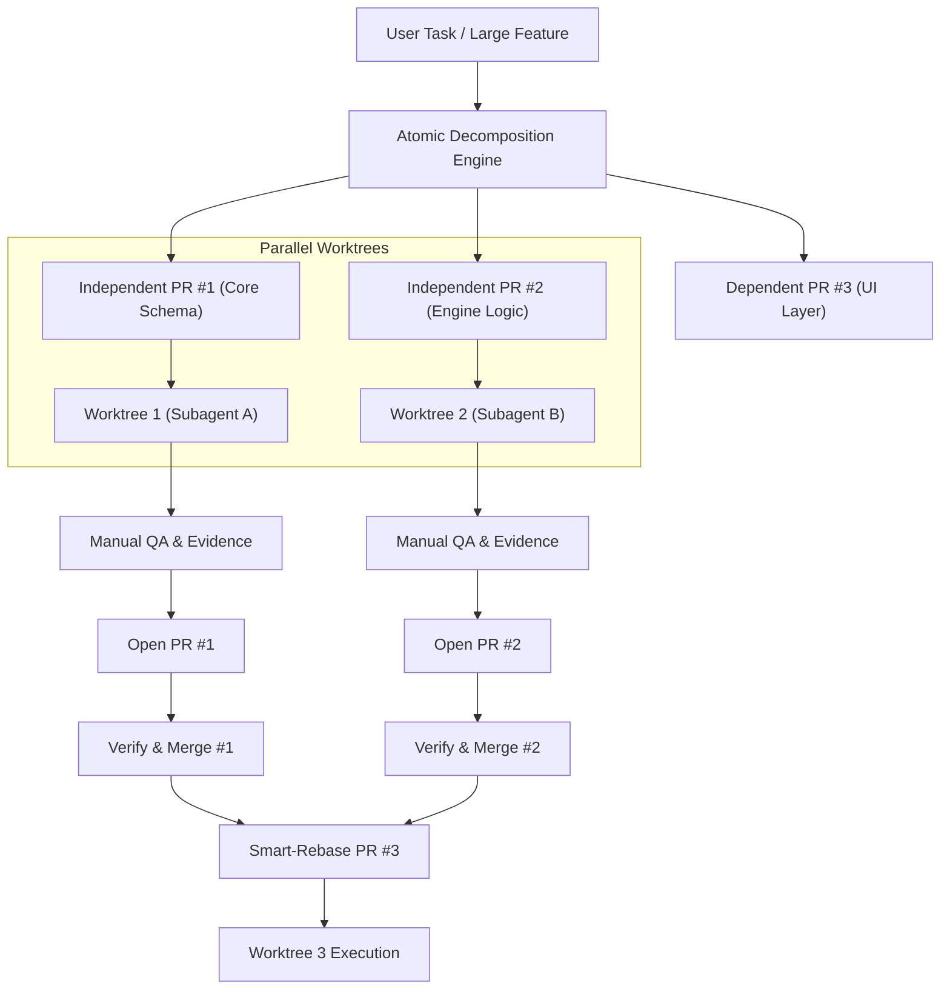

# The Complete OMO Reusable Ecosystem: Skills, Workflows, Engines, and Guardrails

> **Document Status:** Authoritative Reference & Portability Blueprint  
> **Source Base:** `oh-my-opencode` / `oh-my-openagent` (v5.0+ multi-harness architecture)  
> **Target Audience:** AI Agent Engineers, Tooling Developers, Framework Architects  

---

## 1. Executive Summary & Architecture Overview

`oh-my-opencode` (OMO, transitioning to `oh-my-openagent`) is an enterprise-grade agentic operating system and harness extension layer designed originally for OpenCode and extended across Codex CLI, Senpi native extensions, and standalone daemon environments. 

Rather than treating AI agents as simple prompt-completion chatbots, OMO implements a **multi-harness, multi-agent operating system** characterized by:
1. **Separation of Concerns across 20 Core Packages:** Pure TypeScript domain engines decoupled from any specific host harness.
2. **Standardized Skill & Capability Format:** Cross-harness `SKILL.md` specifications with co-located scripts, runtime packages, and references.
3. **Rigid Execution Protocols (The ULW Doctrine):** Evidence-bound state machines, mandatory manual QA, automated worktree isolation, and zero-tolerance for unverified code ("it typechecks is not QA").
4. **Defense-in-Depth Guardrail System:** Over 54 lifecycle hooks protecting against hallucinated file edits, comment vandalism, context compaction truncation, and tool-call deadlocks.

This document provides a complete, structured catalog of the reusable skills, execution workflows, agent archetypes, and modular libraries shipped from OMO, along with exact instructions on how to port and reuse them in other systems (such as Claude Code, Cursor, Windsurf, Cline/Roo, LangGraph, AutoGen, and custom agent runtimes).

```
+--------------------------------------------------------------------------------------------------+
|                                    OMO REUSABLE ECOSYSTEM                                        |
+--------------------------------------------------------------------------------------------------+
|  1. Shipped Skills Catalog (18 Shared + 13 Project-Scope + 10 Senpi/Codex Components)           |
|     - Engineering, Anti-Slop, Browsing, Visual QA, Architecture, Planning, Release, Research     |
+--------------------------------------------------------------------------------------------------+
|  2. Reusable Execution Workflows                                                                 |
|     - ULW Loop (Ultrawork Protocol)         - Work-With-PR (Worktree-Isolated Git Lifecycle)     |
|     - Hyperplan (5-Agent Adversarial Debate) - ULW-Research (Claim-Graph Saturation)             |
|     - Pre-Publish (12-Agent Nuclear Gate)   - Security-Research (Vulnerability & PoC Swarm)      |
+--------------------------------------------------------------------------------------------------+
|  3. 11 Canonical Agent Archetypes                                                                |
|     - Primary Orchestrators: Sisyphus, Atlas, Prometheus, Hephaestus                             |
|     - Read-Only Consultants: Oracle, Librarian, Explore, Multimodal-Looker                       |
|     - Specialized Reviewers: Metis (Pre-planning), Momus (Plan review), Sisyphus-Junior (Worker) |
+--------------------------------------------------------------------------------------------------+
|  4. Standalone Core Engines (Pure TypeScript / Node / Bun / Rust)                                |
|     - hashline-core (LINE#ID Edit)           - boulder-state (Session Work Tracking)             |
|     - rules-engine (Contextual Markdown)     - agents-md-core (Hierarchical Memory)              |
|     - comment-checker-core (Anti-Slop)       - senpi-task (DAG Scheduler & Frontiers)           |
|     - lsp-core / lsp-daemon (Headless LSP)   - skills-loader-core (Cross-Harness Loader)         |
|     - openclaw-core (Multi-Channel Gateway)  - team-core / delegate-core (Agent Mailbox & IPC)   |
+--------------------------------------------------------------------------------------------------+
|  5. Guardrails & Lifecycle Hook Architecture                                                     |
|     - Write Existing File Guard              - Comment Checker Linter                            |
|     - Compaction State Preservers            - Tool Pair & JSON Error Recovery                   |
+--------------------------------------------------------------------------------------------------+
```

---

## 2. Complete Catalog of Shipped Skills

OMO organizes skills across three primary tiers:
- **`packages/shared-skills/skills/`**: Cross-harness portable skills shared between OpenCode and Codex CLI.
- **`.agents/skills/`**: Authoritative project-scope skills and workflow orchestrators.
- **`packages/omo-senpi/skills/` & `packages/omo-codex/plugin/components/`**: Harness-specific task, DAG, and component extensions.

### 2.1 Cross-Harness Core Skills (`packages/shared-skills/skills/`)

| Skill Name | Primary Triggers | Core Responsibility | Shipped Assets & Mechanics | Portability & Reuse Guide |
|---|---|---|---|---|
| **`programming`** | `implement`, `code`, `feature`, `build` | Production code generation adhering to clean architecture, typed contracts, and fail-fast assertions. | References covering idiom standards, error boundaries, and defensive API typing. | Directly reusable as a system prompt addition or `SKILL.md` in any agent system. |
| **`debugging`** | `debug`, `error`, `bug`, `failing test`, `fix crash` | Root-cause analysis workflow: reproduce minimally, isolate hypothesis, assert failure, patch, verify fix. | Structured debugging checklist; forbids speculative guessing; mandates deterministic repro. | Excellent as a standardized debugging skill across Cline, Cursor, or Claude Code. |
| **`refactor`** | `refactor`, `clean up code`, `restructure`, `modernize` | Behavior-preserving transformation: lock semantics with tests first, execute atomic step-by-step refactoring, continuous test gating. | Rules on extracting interfaces, eliminating god objects, and avoiding scope creep. | Drop-in reference for code refactoring instructions. |
| **`remove-ai-slops`** | `deslop`, `remove slop`, `clean ai code`, `remove-ai-slops` | Purges AI-generated code smells across 9 categories (obvious comments, over-defensive code, needless abstraction, dead code, etc.) behind regression tests. | 338-line detailed classification matrix with strict proof requirements before removing boundary defenses. | **High Value Reusable Skill:** One of the most effective prompt guides to eliminate LLM boilerplate and comment vandalism. |
| **`ast-grep`** | `ast-grep`, `sg`, `structural search`, `code rewrite` | Precise AST-based structural search and syntax-tree rewriting using `ast-grep` (`sg`). | Includes automated install scripts (`install.sh`, `install.ps1`), YAML pattern templates, and CLI wrappers. | Requires the `sg` binary; gives agents 10x higher precision than regex for refactoring. |
| **`lsp-setup`** | `lsp`, `language server`, `diagnostics`, `typecheck` | Headless language server configuration, symbol resolution, and diagnostic extraction. | Connects to `packages/lsp-tools-mcp` and language server binaries (tsserver, pyright, gopls, rust-analyzer). | Reusable as an MCP server or CLI driver for headless editor services. |
| **`browser`** | `browse`, `web page`, `browser test`, `scrape`, `click` | Lightweight headless web browsing and interaction engine. | Powered by the staged `omowright` runtime (`skills/browser/scripts/omowright.mjs`), with full digest validation. | Reusable browser execution script; zero heavy external dependencies compared to standard Playwright. |
| **`ultimate-browsing`** | `deep search`, `research web`, `insane search`, `multi-engine search` | Advanced multi-source search engine with ranking, filtering, scraping, and content aggregation. | Ships an entire 17-module Python engine (`engine/`) diverged from `fivetaku/insane-search`. | Standalone Python search backend that can run as a local microservice or tool. |
| **`frontend`** | `frontend`, `ui`, `component`, `tailwind`, `design system` | Enterprise UI/UX development adhering to curated design foundations, typography, spacing, and micro-interactions. | Materializes pinned submodules: `taste-skill`, `ui-ux-pro-max`, `open-design`, `designpowers`. | Comprehensive design token and layout intelligence usable in React/Vue/Svelte development. |
| **`visual-qa`** | `visual test`, `screenshot compare`, `ui smoke`, `pixel check` | Visual verification of rendered components and layouts against design specifications. | Scripts invoking headless browser screenshots, viewport testing, and artifact saving. | Bridges frontend code generation with verified visual evidence. |
| **`git-master`** | `git`, `rebase`, `cherry-pick`, `worktree`, `bisect`, `merge` | Advanced Git operations: clean history maintenance, conflict resolution, worktree management, and bisect automation. | Safe Git workflows, pre-commit checklist, and non-destructive stash/branch policies. | Reusable in developer agent CLIs to enforce safe Git practices. |
| **`init-deep`** | `init-deep`, `/init-deep`, `document codebase`, `generate agents.md` | Automated discovery and hierarchical generation of `AGENTS.md` knowledge bases across root and subdirectories. | Concurrently fires background exploration subagents, queries LSP symbol graphs, and scores directories by complexity. | **High Value:** Allows any project to bootstrap comprehensive documentation tailored for LLM agents. |
| **`ulw-plan`** | `ulw-plan`, `plan task`, `create roadmap`, `architecture plan` | Multi-phase planning engine producing structured, checklist-driven plans with clear dependencies and verification waves. | Formal plan schema (`## TODOs`, `## Final Verification Wave`, task numbering `T1`, `T2`, `F1`). | Reusable planning prompt and schema for complex coding tasks. |
| **`ulw-execute`** | `ulw-execute`, `execute plan`, `run boulder`, `continue work` | The execution runner for approved plans. Tracks progress in `boulder.json` and prevents continuation halts. | State-machine integration with `boulder-state` and todo list validation. | Standard execution harness for long-running, multi-step tasks. |
| **`ulw-research`** | `ulw-research`, `deep research`, `exhaustive investigation` | Maximum-saturation research orchestrator with parallel worker swarms, claim graphs, and proof-by-execution. | Zero-dependency Node CLI (`report-tools.mjs`), claim graph validator, and `outcome verify` delivery gate. | **High Value:** Industrial-strength research framework with automated verification of every asserted claim. |
| **`review-work`** | `review work`, `pr review`, `code audit`, `sanity check` | Independent verification gate: validates that changes match requirements, tests pass, and no regressions exist. | Orchestrator manual QA and gate review checklist. | Reusable code review prompt and procedure. |
| **`coding-agent-sessions`**| `session history`, `search transcripts`, `resume task` | Introspection and search across historical agent conversation transcripts and state files. | JSONL transcript indexing and SQLite session search helpers. | Useful for multi-session agent persistence and context recovery. |
| **`data-scientist`** | `data analysis`, `statistics`, `pandas`, `model train` | Data exploration, feature engineering, regression, classification, and statistical testing standards. | Best practices for notebook hygiene, reproducible data pipelines, and leakage prevention. | Standard data science playbook. |

---

### 2.2 Project-Scope & Governance Skills (`.agents/skills/`)

These skills represent high-level operational workflows that govern repo safety, delivery, and quality assurance:

| Skill | Trigger Phrases | Role & Deliverables | Reusable Pattern / Value |
|---|---|---|---|
| **`work-with-pr`** | `create a PR`, `implement and PR`, `work-with-pr`, `parallel PRs` | Full PR lifecycle in an isolated git worktree: plan -> atomic implementation -> mandatory manual QA evidence -> PR -> CI verification -> merge. | Isolates agent work completely from `main`/`dev`; prevents dirty working directories; enforces atomic PR decomposition. |
| **`hyperplan`** | `hyperplan`, `hpp`, `adversarial plan`, `cross-critique plan` | Adversarial multi-agent planning. Spawns 5 hostile personas to debate and critique assumptions before formalizing an executable plan. | Prevents architectural blind spots and over-engineering through synthetic cognitive diversity. |
| **`security-research`** | `security-research`, `vulnerability audit`, `threat model` | Parallel multi-agent security audit: 3 vulnerability hunters explore attack vectors while 2 PoC engineers prove exploitability. | Elevates security review from vague checklist suggestions to verified Proof-of-Concept exploits. |
| **`tech-debt-audit`** | `tech debt`, `technical debt audit`, `code health` | 9-dimension codebase audit (circular dependencies, type safety, dead code, architectural rot) emitting `TECH_DEBT_AUDIT.md`. | Uses AST-grep and LSP to generate quantified, prioritized refactoring roadmaps. |
| **`pre-publish-review`**| `pre-publish review`, `ready to publish?`, `release gate` | Nuclear-grade 12-agent release gate: detects diff against latest npm release, runs 10 deep per-change analysts, and requires synthesis by an Oracle agent. | Eliminates accidental regressions, API breaks, and missing artifacts in package releases. |
| **`github-triage`** | `triage`, `triage issues`, `triage PRs`, `github triage` | Read-only issue and PR analysis. Spawns background tasks and writes evidence-backed reports with permalinks. Never takes mutating GitHub actions. | Safe, read-only agent triage for open source repositories. |
| **`remove-deadcode`** | `remove dead code`, `cleanup unused`, `remove-deadcode` | Safely detects and removes unreachable functions, files, and dependencies verified via LSP references. | Automated code footprint reduction without breaking runtime reflection or dynamic exports. |
| **`opencode-qa`** | `opencode qa`, `test opencode`, `verify hook` | First-party integration QA harness for OpenCode: asserts SSE hook events, inspects SQLite sessions, runs TUI smoke in tmux. | Template for integration testing plugin-based AI harnesses. |
| **`codex-qa`** | `codex qa`, `test codex plugin`, `codex app-server` | Isolated Codex CLI QA harness: mocks model APIs, runs `codex app-server`, verifies hook firing notifications. | Template for hermetic plugin testing without hitting live LLM billing endpoints. |
| **`senpi-qa`** | `senpi qa`, `verify senpi task`, `senpi task e2e` | Live Senpi adapter QA: verifies task execution, state machine transitions, and DAG frontier scheduling in isolated directories. | End-to-end driver for testing complex agent state machines. |

---

### 2.3 Senpi Native Task & DAG Skills (`packages/omo-senpi/skills/`)

| Skill | Description & Reusable Capability |
|---|---|
| **`dag-library`** | Formal library of pre-compiled DAG templates for complex multi-agent pipelines (parallel refactoring, migration matrices, multi-package builds). |
| **`mass-ulw`** | Massive multi-task fan-out: orchestrates dozens of parallel worker agents across an entire repository under global rate limits. |
| **`give-me-tips`** | Interactive agent coaching that suggests next actions, missing tests, or optimizations based on the current session diff. |
| **`onboarding`** | Automated developer onboarding agent: maps environment dependencies, builds local devcontainers, and runs initial smoke tests. |

---

## 3. Shipped Execution Workflows (The Operational Playbooks)

OMO's most impactful innovation is not simply its tool collection, but its **strictly enforced execution protocols**. These workflows can be adopted by any development team or agent harness.

```
+--------------------------------------------------------------------------------------------------+
|                                    THE ULW-LOOP STATE MACHINE                                    |
+--------------------------------------------------------------------------------------------------+
|                                                                                                  |
|   +---------------+      +----------------+      +---------------+      +--------------------+   |
|   | 1. EXPLORE    | ---> | 2. PLAN        | ---> | 3. ATOMIC     | ---> | 4. WORKTREE        |   |
|   | Map codebase  |      | Write plan     |      |    TODOS      |      |    ISOLATION       |   |
|   | LSP / Symbols |      | to disk        |      | 1 todo/unit   |      | git worktree add   |   |
|   +---------------+      +----------------+      +---------------+      +--------------------+   |
|                                                                                    |             |
|                                                                                    v             |
|   +---------------+      +----------------+      +---------------+      +--------------------+   |
|   | 8. MERGE      | <--- | 7. CI & GATE   | <--- | 6. OPEN PR    | <--- | 5. IMPLEMENT &     |   |
|   | Merge commit  |      | VERIFICATION   |      | Reviewer-     |      |    MANUAL QA       |   |
|   | Clean worktree|      | Unbounded loop |      | readable body |      | Write evidence     |   |
|   +---------------+      +----------------+      +---------------+      +--------------------+   |
|                                                                                                  |
+--------------------------------------------------------------------------------------------------+
```

### 3.1 The ULW (Ultrawork) & ULW-Loop Protocol

The ULW Loop is a deterministic execution state machine designed to eliminate "lazy agent" behaviors, premature task completion, and hallucinated test passes.

#### The 8 Mandatory Laws of ULW:
1. **Explore Before Editing:** The agent must map the real files, trace call paths via LSP symbols, and measure blast radius. Patching from memory is forbidden.
2. **Make a Written Plan:** The agent must write the full plan to disk (`.omo/plans/<name>.md`) detailing every file, every modification, and the exact verification for each step.
3. **Ultra-Detailed Atomic Todos:** The plan must be mirrored into the todo list with 1-to-1 granularity (one todo per edit-plus-verification unit). High-level todos like "implement feature" are rejected.
4. **Isolated Worktree Execution:** All code modifications must occur in a dedicated git worktree (`git worktree add`). The main working directory is never touched directly.
5. **Mandatory Evidence-Bound Manual QA:** 
   - *"It typechecks" is NOT QA.*
   - *"`bun test` is green" is NOT QA.*
   - The agent must drive the real user-facing surface (CLI, server API, browser, or TUI) and write the raw execution evidence to `.omo/evidence/<timestamp>-<slug>/`. If there is no evidence file on disk, **the QA did not happen**.
6. **Reviewer-Readable PR Creation:** A PR is opened with a standardized template containing:
   - What was tested (exact commands and surfaces).
   - What was observed (before/after comparison and isolation proof).
   - Why it is sufficient (regression risk coverage).
   - SHA256 checksums of all local evidence files.
7. **The Verification Loop:** CI checks and automated review bots are monitored. Any failure immediately cycles back to the implementation step inside the worktree.
8. **Strict Merge Policy:** PRs are merged using standard merge commits (preserving individual commit history). Rebase-merge and squash-merge are forbidden.

---

### 3.2 The Work-With-PR Protocol

The `work-with-pr` workflow automates the division of large, risky coding tasks into small, independently mergeable pull requests:



#### Reusable Value:
- **Zero Working Tree Contamination:** Developers and agents can run multiple concurrent tasks without file conflicts.
- **Fail-Safe Rollback:** If a subagent goes off the rails, deleting the worktree completely cleans the state without affecting git index.

---

### 3.3 The Hyperplan Adversarial Planning Protocol

Standard LLM planning often suffers from confirmation bias: an agent generates a plan and immediately agrees with its own assumptions. Hyperplan breaks this by orchestrating a synthetic cross-critique debate across 5 hostile personas:

| Persona | Focus & Attack Angle |
|---|---|
| **Unspecified-Low** | Practical minimalist: attacks complexity, questions whether new code is needed at all, advocates for standard library / existing helpers. |
| **Unspecified-High** | Systems architect: attacks scalability limits, performance bottlenecks, concurrency races, and backward compatibility. |
| **Deep** | Edge-case hunter: attacks boundary conditions, nullability, error handling, filesystem permissions, and network timeouts. |
| **Ultrabrain** | Theoretical formalist: attacks type soundness, invariant preservation, state machine completeness, and algorithmic complexity. |
| **Artistry** | API designer / DX critic: attacks naming ergonomics, developer friction, documentation clarity, and interface readability. |

**The Process:**
1. The orchestrator collects the user requirements and drafts an initial proposal.
2. The 5 personas analyze the proposal in parallel and generate scathing, evidence-backed critique memos.
3. The orchestrator discards personal preferences and filters for **defensible, structural insights**.
4. The distilled insight bundle is handed to a dedicated planning agent to formalize an executable, risk-mitigated plan.

---

### 3.4 The ULW-Research Protocol (Maximum-Saturation Research)

Designed for mission-critical investigations where missing a single detail or relying on hallucinations causes project failure:

```
[ Research Objective ]
          |
          v
[ Phase 0: Axis Decomposition ] ---> Spawns parallel worker swarm across documentation, source code, issues, web
          |
          v
[ Phase 1: Exhaustive Fan-Out ] ---> Workers collect raw observations; expand every unexplored lead
          |
          v
[ Phase 2: Claim-Graph Engine ] ---> Constructs directed graph of claims:
                                      - Every claim must have an independent verification source
                                      - Contested / performance claims MUST run real benchmark code
          |
          v
[ Phase 3: Delivery Gating ]    ---> Static Gate (formatting) -> Layout Gate -> Proofread Pass
          |
          v
[ Phase 4: Outcome Verification]---> `outcome verify` CLI validates zero unproven claims before outputting
```

---

## 4. Shipped Agent Archetypes (The 11 Agent Matrix)

OMO defines 11 distinct agent roles. Each agent has explicit permissions, tool restrictions, default models, and fallback chains:

```
+----------------------------------------------------------------------------------------------------+
|                                      THE 11 AGENT ARCHETYPES                                       |
+----------------------------------------------------------------------------------------------------+
|                                                                                                    |
|  PRIMARY ORCHESTRATORS (Full Tool Access, Plan Execution)                                          |
|  +----------------------------------------------------------------------------------------------+  |
|  | SISYPHUS          | Default: Claude Opus 5.5 (32k Think) | General lead, task decomposition   |  |
|  | HEPHAESTUS        | Default: GPT-5.6 Sol (Deep Worker)   | Autonomous implementation, refactor|  |
|  | ATLAS             | Default: Claude Sonnet 5             | Todo-list orchestrator, coordination |  |
|  | PROMETHEUS        | Default: Claude Fable 5              | Strategic interview planner (.md only) |
|  +----------------------------------------------------------------------------------------------+  |
|                                                                                                    |
|  READ-ONLY CONSULTANTS (Strict Tool Denial: write, edit, task blocked)                             |
|  +----------------------------------------------------------------------------------------------+  |
|  | ORACLE            | Default: GPT-5.6 Sol (0.1 Temp)      | High-reasoning second opinion/review |  |
|  | LIBRARIAN         | Default: GPT-6 Luna Fast             | External documentation, web search   |  |
|  | EXPLORE           | Default: GPT-6 Luna Fast             | Rapid codebase grep, symbol tracing  |  |
|  | MULTIMODAL-LOOKER | Default: GPT-5.6 Sol Low             | Image, screenshot, and PDF analysis  |  |
|  +----------------------------------------------------------------------------------------------+  |
|                                                                                                    |
|  SPECIALIZED ADVISORS & WORKERS                                                                    |
|  +----------------------------------------------------------------------------------------------+  |
|  | METIS             | Default: Claude Fable 5.1 (0.3 Temp) | Pre-planning consultant (divergent)  |  |
|  | MOMUS             | Default: GPT-5.6 Terra (0.1 Temp)    | Plan reviewer (pessimistic auditor)  |  |
|  | SISYPHUS-JUNIOR   | Default: Claude Sonnet 5             | Category-spawned execution subagent  |  |
|  +----------------------------------------------------------------------------------------------+  |
|                                                                                                    |
+----------------------------------------------------------------------------------------------------+
```

### Tool Access Matrix:
- **Oracle / Librarian / Explore:** Denied `write`, `edit`, `task`, `call_omo_agent`. They cannot modify code or spawn nested subagents.
- **Multimodal-Looker:** Denied ALL tools except `read`.
- **Prometheus:** Write operations are intercepted by the `prometheus-md-only` hook; it can write `.md` planning artifacts, but never source code.
- **Momus:** Denied `write`, `edit`, and `task`; plan auditing is strictly advisory.

---

## 5. Shipped Core Libraries & Modular Engines

The `packages/` directory contains 20 core TypeScript packages, 4 MCP packages, and Rust/Crate tooling that are completely decoupled from OpenCode and can be reused in any project:

### 5.1 `hashline-core` (`@oh-my-opencode/hashline-core`)
- **What it does:** Solves the notorious LLM file editing failure where agents hallucinate line numbers or produce fuzzy diff application errors.
- **How it works:**
  - Formats files by tagging every line with an xxHash32 content hash: `LINE#HASH| content`.
  - Edits are specified as `replace`, `append`, or `prepend` referencing the exact line hash.
  - If the line content has changed since the agent read it, the edit is immediately rejected with `HashlineMismatchError` rather than silently corrupting adjacent code.
  - Auto-strips accidental Markdown echoes, normalizes CRLF/LF, and generates unified diffs.
- **How to reuse:** Import into any CLI or agent tool runner to replace brittle `str.replace` or unified diff parsers.

### 5.2 `boulder-state` (`@oh-my-opencode/boulder-state`)
- **What it does:** Zero-dependency functional state machine that persists agent progress across session resets, subagent forks, and crashes.
- **How it works:**
  - Persists state in `<root>/.omo/boulder.json`.
  - Tracks the active plan, top-level tasks, individual task timers, and child session mappings.
  - Automatically parses markdown checklists (`[x]`, `[ ]`, `[~]`) and detects completed vs pending phases.
  - Provides automatic stale-work reconciliation (demoting zombie sessions after timeouts).
- **How to reuse:** Ideal for any CLI tool that needs persistent task resumption across multi-turn LLM calls.

### 5.3 `rules-engine` (`@oh-my-opencode/rules-engine`)
- **What it does:** Contextual Markdown rule discovery and dynamic prompt injection.
- **How it works:**
  - Scans upward from the current file through `.omo/rules/`, `.cursor/rules/`, `.claude/rules/`, and `.github/instructions/`.
  - Matches rule files against active file paths using `picomatch` globs (`*.ts`, `src/api/**`).
  - Supports YAML frontmatter (`alwaysApply: true`, negative exclusions).
  - Enforces character budgets (static 12KB, dynamic 4KB) with intelligent truncation.
- **How to reuse:** Drop into any agent harness to support multi-vendor rule directories (`.cursorrules`, `.clauderules`, `.omorules`) in a single unified engine.

### 5.4 `agents-md-core` (`@oh-my-opencode/agents-md-core`)
- **What it does:** Hierarchical `AGENTS.md` discovery and session injection.
- **How it works:**
  - When an agent accesses a file in `packages/core/src/utils/`, this package walks up the directory tree to find `packages/core/src/AGENTS.md`, `packages/core/AGENTS.md`, etc.
  - Injects a formatted `[Directory Context: ...]` block into the LLM context.
  - Maintains a per-session cache so the same directory context is never injected twice.
  - Prevents path traversal vulnerabilities using `realpathSync` validation.
- **How to reuse:** Use in multi-package or monorepo agent harnesses to automatically scope context to the active directory.

### 5.5 `comment-checker-core` (`@oh-my-opencode/comment-checker-core`)
- **What it does:** Guards codebases against LLM "comment vandalism" and placeholder regressions (e.g. `// TODO: rest of implementation remains the same`, `/* helper functions here */`).
- **How it works:**
  - Parses LLM patch requests into structured file edits.
  - Pipes edits to the `@code-yeongyu/comment-checker` binary via standard input.
  - Returns exit code `2` if AI-slop comments are introduced, blocking the tool call before the file is modified on disk.
- **How to reuse:** Integrate as a Git pre-commit hook or agent post-edit interceptor.

### 5.6 `senpi-task` (`@oh-my-opencode/senpi-task`)
- **What it does:** Industrial task execution and Directed Acyclic Graph (DAG) dependency-frontier scheduler for autonomous agents.
- **How it works:**
  - State machine supporting 7 task states: `pending`, `running`, `completed`, `error`, `cancelled`, `interrupted`, `lost`.
  - **DAG Frontier Admission:** Nodes execute as soon as all their `dependsOn` dependencies complete and execution slots are open.
  - **Residency Lifecycle & Revival:** Sessions survive process restarts; background children reattach without replaying prompts.
  - Durable JSONL append-only storage and filesystem Write-Ahead Logging (WAL).
  - Inter-agent messaging via durable file mailboxes with exactly-once delivery guarantees.
- **How to reuse:** Use as the core orchestration backend for complex multi-agent coding workflows.

### 5.7 `lsp-core`, `lsp-daemon`, & `lsp-tools-mcp`
- **What it does:** Headless Language Server Protocol (LSP) client and daemon.
- **How it works:**
  - Spawns and manages persistent LSP instances across TypeScript, Python, Rust, Go, etc.
  - Exposes 8 standard tools to the agent: `lsp_diagnostics`, `lsp_goto_definition`, `lsp_find_references`, `lsp_symbols`, `lsp_status`, `lsp_prepare_rename`, `lsp_rename`, `lsp_install_decision`.
  - Handles daemon heartbeats, auto-restart on crash, and workspace root detection.
- **How to reuse:** Run `packages/lsp-tools-mcp` as an MCP server to provide rich code intelligence to Claude Desktop, Cursor, or Cline.

### 5.8 `skills-loader-core` (`@oh-my-opencode/skills-loader-core`)
- **What it does:** Harness-neutral skill discovery, precedence resolution, and dynamic loading.
- **How it works:**
  - Searches for skills across multiple origins: project-local (`.agents/skills/`), user-global (`~/.omo/skills/`), and packaged defaults (`packages/shared-skills/`).
  - Resolves name collisions with strict precedence ordering.
  - Parses YAML frontmatter descriptions, trigger keywords, and argument hints.
- **How to reuse:** The ideal library for building custom skill loaders in any TypeScript-based CLI.

### 5.9 `openclaw-core` (`@oh-my-opencode/openclaw-core`)
- **What it does:** Multi-channel communication gateway connecting agents to human platforms.
- **How it works:**
  - Unified message translation across Discord bots, Telegram bots, HTTP webhooks, and local terminal pipes.
  - Supports asynchronous reply listener daemons and background job notifications.
- **How to reuse:** Embed in agents that need to notify teams via Slack/Discord when builds fail or PRs are ready.

---

## 6. Shipped Guardrails & Lifecycle Hook Architecture

OMO wraps the model in a 54+ lifecycle hook defense system that intercepts prompts, tool calls, and session events:

```
[ LLM Generation ]
        |
        v
+-----------------------+
| tool.execute.before   | ---> write-existing-file-guard (Blocks blind file overwrite)
|                       | ---> prometheus-md-only (Restricts planner to markdown files)
|                       | ---> rules-injector (Matches and injects path-specific rules)
|                       | ---> question-label-truncator (Prevents UI overflow)
+-----------------------+
        |
        v
[ Tool Runs on OS / Disk ]
        |
        v
+-----------------------+
| tool.execute.after    | ---> comment-checker (Catches placeholder/TODO slop)
|                       | ---> json-error-recovery (Auto-fixes malformed JSON tool args)
|                       | ---> hashline-read-enhancer (Tags returned lines with hash anchors)
|                       | ---> output-truncator (Caps massive outputs to protect context)
+-----------------------+
        |
        v
+-----------------------+
| Compaction Hooks      | ---> compaction-todo-preserver (Carries todos across context truncation)
|                       | ---> compaction-context-injector (Re-injects project overview)
+-----------------------+
```

### Key Guardrails for External Adoption:
1. **`write-existing-file-guard`:** If an agent attempts to call a file-write tool on a file that already exists without explicitly reading it first, the tool call is blocked with an informative prompt instruction. This prevents agents from blindly blowing away existing code.
2. **`json-error-recovery`:** When small models emit JSON with trailing commas, unescaped newlines, or missing brackets, this hook sanitizes the JSON and retries the call transparently instead of returning a fatal error to the conversation.
3. **`compaction-todo-preserver`:** When context window limits force session compaction, standard LLMs lose track of what step of the plan they were on. This hook extracts active todo items from memory, preserves them in durable storage, and re-injects them immediately into the first turn post-compaction.
4. **`tool-pair-validator`:** Detects repetitive tool loops (e.g. an agent calling `ls` or `grep` 5 times with identical parameters) and injects a stern intervention instructing the model to synthesize findings or ask for clarification.

---

## 7. Practical Integration Blueprint: How to Reuse OMO

### 7.1 Porting Skills to Claude Code or Cursor
Every skill in `packages/shared-skills/skills/` conforms to the open `SKILL.md` format.
- To port to **Claude Code**:
  Copy any skill directory (e.g. `packages/shared-skills/skills/remove-ai-slops`) directly into `.claude/skills/` or `~/.claude/skills/`.
- To port to **Cursor**:
  Extract the instructions from `SKILL.md` and place them under `.cursor/rules/<skill-name>.mdc` with appropriate file glob triggers.

### 7.2 Reusing the Core NPM Packages
All core packages are authored in pure TypeScript with standard package boundaries:
```json
{
  "dependencies": {
    "@oh-my-opencode/hashline-core": "workspace:*",
    "@oh-my-opencode/rules-engine": "workspace:*",
    "@oh-my-opencode/boulder-state": "workspace:*",
    "@oh-my-opencode/senpi-task": "workspace:*"
  }
}
```
You can publish or symlink these packages into your own developer tools or agent runners to immediately gain hash-based line editing, hierarchical rule matching, or DAG scheduling.

### 7.3 Adopting the ULW Engineering Doctrine in Your Team
Even without running OMO's software, any engineering team using AI assistants can adopt the **ULW Rulebook**:
1. Require AI agents to work in isolated git worktrees (`git worktree add -b feat/...`).
2. Require a written plan on disk with explicit checkboxes before code is modified.
3. Enforce the evidence rule: Every PR must include reproduction logs, test run evidence, and CLI output verification.
4. Run automated pre-commit comment checking to prevent AI placeholder slop.

---

## 8. Summary Table of Key Assets

| Asset Category | Item Count | Key Highlights |
|---|---|---|
| **Portable Skills** | 18 Shared Skills | `remove-ai-slops`, `ulw-research`, `init-deep`, `frontend`, `ast-grep`, `ultimate-browsing` |
| **Governance Skills** | 13 Project Skills | `work-with-pr`, `hyperplan`, `pre-publish-review`, `security-research`, `tech-debt-audit` |
| **Operational Protocols** | 5 Workflows | ULW-Loop, Worktree-Isolated PR, Hyperplan Debate, Saturation Research, Nuclear Release Gate |
| **Agent Archetypes** | 11 Agent Matrix | Sisyphus, Hephaestus, Oracle, Librarian, Explore, Multimodal-Looker, Metis, Momus, Atlas, Prometheus, Junior |
| **Core Libraries** | 20 TS Packages | `hashline-core`, `boulder-state`, `rules-engine`, `senpi-task`, `lsp-core`, `agents-md-core` |
| **Guardrail Hooks** | 54+ Interceptors | File overwrite guard, Comment checker, Compaction preserver, Tool-pair loop breaker |
